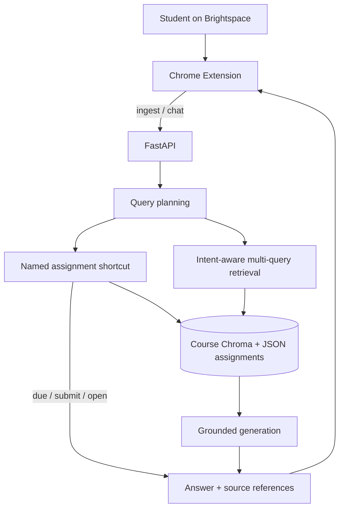

# CourseBrain

<p align="center">
  
</p>

CourseBrain is a Chrome-based course assistant. It indexes materials from a student's LMS, stores them in a course-specific vector collection, and answers questions from those materials with source references.

The current integration is [Brightspace](https://brightspace.usc.edu). A student opens the side panel on a course page, syncs the current course, then asks questions such as “When is Homework 1 due?” or “Where is Newton's method explained?”

## Problem

Course information is spread across lecture files, module pages, the syllabus, assignments, and announcements. Finding one fact often means opening several Brightspace pages.

CourseBrain turns those materials into a searchable course knowledge layer: ingest once, then ask in natural language and jump back to the source.

## Architecture



The extension syncs via `POST /api/v1/ingest/batch` and asks via `POST /api/v1/chat`. Due-date and submit-location questions can return from the assignment object without a chat completion. Other questions go through `planned_retrieval` on that course's Chroma collection, then `chat_with_rag`. Each chat request is `course_id` + `message`.

Most of the backend lives in `api/app/services/`:

- [`retrieval_router.py`](api/app/services/retrieval_router.py) — intent tiers, multi-query merge, and scoped retrieval when the question names something like HW1
- [`rag.py`](api/app/services/rag.py) — `chat_with_rag`: assignment lookup, retrieval, prompt, `[SOURCE N]` citations
- [`query_intent.py`](api/app/services/query_intent.py) — turns a question into an intent and English search queries
- [`brightspace-indexer.ts`](extension/src/content/brightspace-indexer.ts) — discovers Brightspace modules, files, and assignments for ingest

Due dates come from the assignment object when possible. Course-wide grading questions stay on syllabus-style sources, not project rubrics — see [`test_retrieval_router.py`](api/tests/test_retrieval_router.py) and [`test_grade_policy.py`](api/tests/test_grade_policy.py).

## Example query flow

Using [`sample_data/intro-numerical-methods`](sample_data/intro-numerical-methods):

**“Where is Newton's method explained?”**

1. `plan_query` labels the question `LEARNING` and emits search queries such as `Newton's method explanation`
2. `planned_retrieval` searches the NUM-201 collection, lecture-first
3. Matching lecture chunks become `[SOURCE N]` context (no URLs in the prompt)
4. The model answers from those chunks; the API returns source links
5. The extension can open the lecture page and jump to the cited page

**“When is Homework 1 due?”**

1. Identifier matching resolves `Homework 1` to a synced assignment object
2. The aspect is `due`, so the API returns the structured due date
3. No chat completion is required for that answer

## Tech stack

| Layer | |
| --- | --- |
| Extension | Chrome Manifest V3, React, TypeScript, Vite, esbuild |
| API | FastAPI, Pydantic, Uvicorn |
| Retrieval / generation | OpenAI embeddings + chat, custom retrieval router |
| Storage | ChromaDB (local persistent client), JSON course registry and assignment objects |
| Tests | Python `unittest`, Vitest |

## Running locally

The backend and the sample-data path run without Brightspace. Full course sync needs an authenticated Brightspace session in Chrome.

### 1. API

```bash
cd api
python -m venv .venv
source .venv/bin/activate
pip install -r requirements.txt
cp .env.example .env   # set OPENAI_API_KEY
uvicorn app.main:app --reload --port 8001
```

OpenAPI: http://localhost:8001/docs

### 2. Ingest the sample course

```bash
curl -s http://localhost:8001/api/v1/ingest/batch \
  -H "Content-Type: application/json" \
  -d @../sample_data/intro-numerical-methods/ingest_batch.json
```

Note the returned `course_id`, then:

```bash
curl -s http://localhost:8001/api/v1/chat \
  -H "Content-Type: application/json" \
  -d '{"course_id":"<course_id>","message":"Where is Newton'\''s method explained?"}'
```

Without `OPENAI_API_KEY`, ingest cannot embed. Chat can still return a retrieval excerpt or an assignment-object answer.

### 3. Extension (optional)

```bash
cd extension
npm install
npm run build
```

Chrome → `chrome://extensions` → Load unpacked → `extension/dist/`

Then open a Brightspace course page, sync, and ask from the side panel.

### Tests

```bash
cd api && python -m unittest discover -s tests -v
cd extension && npm test
```

## Layout

```
api/           FastAPI app, retrieval, ingest, tests
extension/     Chrome MV3 side panel, indexer, highlighter
sample_data/   Example ingest payload
```
